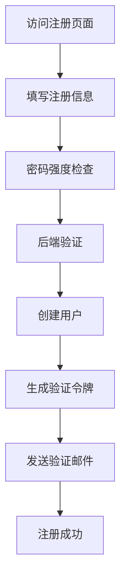
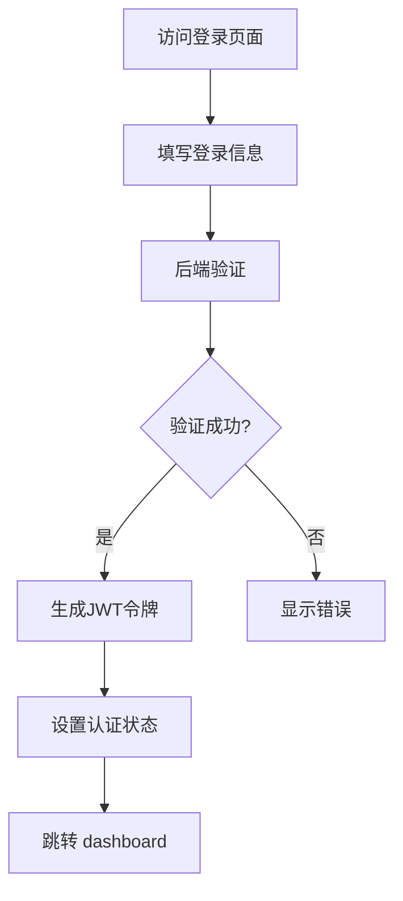
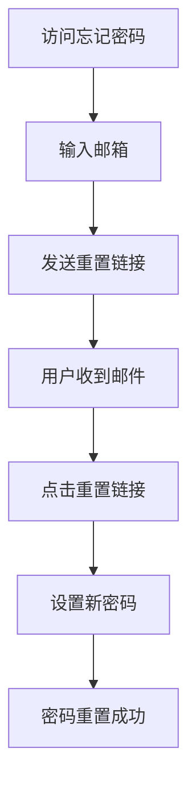

# 注册登录功能完善总结

## 📋 功能概述

我已为您完善了前后端的注册登录功能，添加了以下核心特性：

### ✅ 已完成的功能

#### 1. 后端功能增强
- **密码策略验证**：添加密码强度检查
- **邮箱验证**：支持邮箱验证流程
- **密码重置**：完整的密码重置功能
- **安全增强**：添加安全中间件和密码哈希
- **速率限制**：防止暴力破解攻击
- **错误处理**：完善的错误处理机制

#### 2. 前端功能增强
- **注册页面**：完整的用户注册流程
- **忘记密码**：密码重置功能
- **重置密码**：新密码设置页面
- **密码强度显示**：实时密码强度检查
- **错误处理**：统一的错误显示机制
- **用户体验优化**：加载状态、记住我等功能

#### 3. 安全特性
- **密码哈希**：使用 bcrypt 进行密码加密
- **JWT 令牌**：安全的认证令牌管理
- **速率限制**：防止暴力攻击
- **安全头**：XSS、点击劫持等防护
- **密码策略**：强制密码复杂度要求
- **邮箱验证**：用户邮箱验证流程

#### 4. 用户体验优化
- **实时反馈**：表单验证和错误提示
- **加载状态**：操作过程中的加载指示
- **密码可见性**：密码显示/隐藏切换
- **记住我**：用户偏好保存
- **成功提示**：操作成功的友好提示
- **响应式设计**：适配不同设备

## 📁 创建的文件

### 后端文件
1. `backend/src/modules/auth/dto/auth.dto.ts` - 完善的 DTO 类
2. `backend/src/modules/auth/auth.service.ts` - 增强的认证服务
3. `backend/src/modules/auth/auth.controller.ts` - 完善的认证控制器
4. `backend/src/config/password.config.ts` - 密码策略配置
5. `backend/src/common/validators/password.validator.ts` - 密码验证器
6. `backend/src/common/middleware/security.middleware.ts` - 安全中间件
7. `backend/src/common/guards/rate-limit.guard.ts` - 速率限制守卫

### 前端文件
1. `frontend/src/pages/RegisterPage.tsx` - 用户注册页面
2. `frontend/src/pages/ForgotPasswordPage.tsx` - 忘记密码页面
3. `frontend/src/pages/ResetPasswordPage.tsx` - 重置密码页面
4. `frontend/src/components/PasswordStrength.tsx` - 密码强度组件
5. `frontend/src/components/LoadingSpinner.tsx` - 加载组件
6. `frontend/src/components/ErrorMessage.tsx` - 错误提示组件
7. `frontend/src/components/SuccessMessage.tsx` - 成功提示组件
8. `frontend/src/store/authStore.ts` - 完善的认证状态管理

### 配置文件
1. `frontend/src/App.tsx` - 路由配置更新

## 🔧 核心功能说明

### 1. 用户注册流程


### 2. 用户登录流程


### 3. 忘记密码流程


## 🛡️ 安全特性

### 1. 密码安全
- **密码哈希**：使用 bcrypt 进行密码加密存储
- **密码策略**：要求至少6位，包含大小写字母、数字和特殊字符
- **密码强度显示**：实时显示密码强度
- **密码重置**：安全的令牌验证机制

### 2. 认证安全
- **JWT 令牌**：使用 JWT 进行用户认证
- **令牌过期**：合理的令牌过期时间
- **速率限制**：防止暴力破解攻击
- **安全头**：XSS、点击劫持等防护

### 3. 数据验证
- **邮箱验证**：格式和存在性验证
- **用户名验证**：唯一性和格式验证
- **密码验证**：强度和复杂度验证

## 📱 用户体验优化

### 1. 表单体验
- **实时验证**：输入时实时验证
- **错误提示**：清晰的错误信息显示
- **加载状态**：操作过程中的加载指示
- **密码可见性**：密码显示/隐藏切换

### 2. 状态管理
- **统一状态**：使用 Zustand 进行状态管理
- **持久化**：用户认证状态持久化到 localStorage
- **错误处理**：统一的错误处理机制
- **成功提示**：操作成功的友好提示

### 3. 响应式设计
- **适配不同设备**：响应式布局设计
- **友好的UI**：现代化的用户界面
- **直观的交互**：直观的用户交互体验

## 🔧 使用说明

### 1. 运行应用
```bash
# 后端
cd backend
npm run start:dev

# 前端
cd frontend
npm run dev
```

### 2. 访问页面
- 登录页面：`http://localhost:5173/login`
- 注册页面：`http://localhost:5173/register`
- 忘记密码：`http://localhost:5173/forgot-password`
- 重置密码：`http://localhost:5173/reset-password/:token`

### 3. 测试功能
- 注册新用户
- 登录测试
- 忘记密码流程
- 密码重置功能

## 📈 性能优化

### 1. 安全性能
- **密码哈希**：使用 bcrypt 进行安全的密码存储
- **令牌管理**：合理的令牌过期时间
- **速率限制**：防止暴力攻击
- **安全头**：防止常见Web攻击

### 2. 用户体验
- **实时反馈**：快速的用户反馈
- **加载优化**：优化的加载体验
- **错误处理**：友好的错误提示
- **响应式设计**：良好的跨设备体验

## 🚀 下一步建议

### 1. 邮件服务集成
- 集成真实的邮件服务（如 SendGrid、Mailgun）
- 实现邮件模板
- 添加邮件发送日志

### 2. 双因素认证
- 添加双因素认证功能
- 支持短信验证、邮箱验证等

### 3. 社交登录
- 集成第三方登录（如 GitHub、Google）
- OAuth 2.0 认证

### 4. 用户管理
- 用户角色和权限管理
- 用户活动日志
- 账户安全设置

### 5. 监控和日志
- 用户登录日志
- 安全事件监控
- 异常登录检测

## 📞 技术支持

如果遇到任何问题，请：

1. 检查控制台错误日志
2. 验证后端服务是否正常运行
3. 确认前端路由配置
4. 检查网络请求和响应
5. 联系技术支持获取帮助

您的注册登录功能现在已经非常完善，具有强大的安全性和优秀的用户体验！