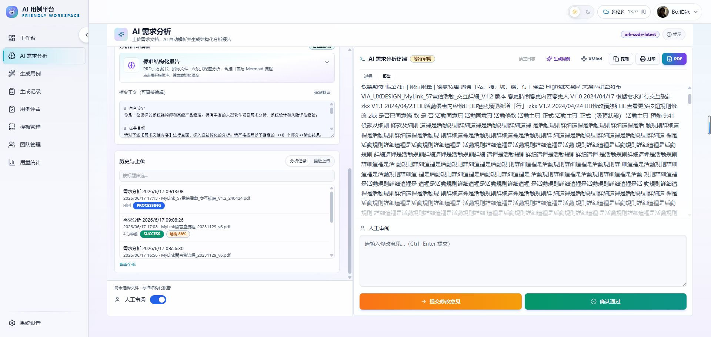
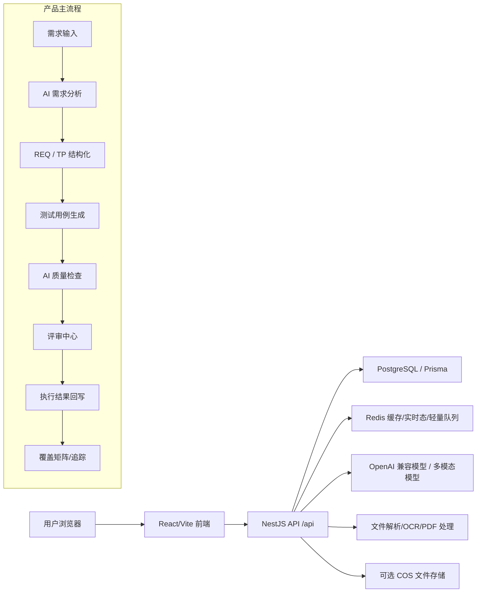

# AI 测试用例生成平台

[](backend/package.json)
[](frontend/package.json)
[](backend/prisma/schema.prod.prisma)
[](frontend/playwright.config.ts)

面向测试分析与交付闭环的 AI 工程平台。它不是单点的“生成器”，而是一条从需求输入、需求分析、用例生成、质量检查、评审修订、执行回写到覆盖追踪的完整链路。

- 测试环境分支：`develop`
- 生产环境分支：`main`
- develop 环境：`http://139.199.69.115:8083`
- main 环境：`http://139.199.69.115`



## 目录

- [项目定位](#项目定位)
- [核心能力](#核心能力)
- [最新变更范围](#最新变更范围)
- [技术栈](#技术栈)
- [系统架构](#系统架构)
- [快速开始](#快速开始)
- [项目使用手册](#项目使用手册)
- [测试与验证](#测试与验证)
- [部署与发布](#部署与发布)
- [仓库结构](#仓库结构)
- [文档导航](#文档导航)
- [开发约定](#开发约定)

## 项目定位

当前项目重点解决四类问题：

1. 需求文档、流程图 PDF、图片等输入解析不稳定。
2. AI 用例生成输出长、易截断、易偏格式。
3. 生成结果需要质量评分、覆盖分析、自动补齐与评审闭环。
4. 发布、运行态缓存、长任务恢复、双环境部署需要工程化支撑。

对应的产品闭环是：

`需求输入 -> AI 需求分析 -> REQ/TP 结构化 -> 用例生成 -> 质量检查/修复 -> 评审中心 -> 执行结果回写 -> 覆盖矩阵`

## 核心能力

| 模块 | 入口 | 当前能力 |
| --- | --- | --- |
| AI 需求分析 | `/ai-analysis` | 文档/PDF/图片上传，SSE 流式分析，结构化报告，Mermaid 流程图，REQ/TP 追踪，版本与 diff |
| 文件解析 | 后端 `files` 模块 | PDF 文本层、多模态解析、OCR 兜底、分页视觉解析、实时进度、失败恢复 |
| 用例生成 | `/generate` | 流式/非流式生成，严格 schema 约束，长输出续写，分页展示，导出 `xlsx/json/md` |
| AI 质量检查 | 生成结果侧栏与记录详情 | 覆盖率、重复/空泛/不可执行检测、风险等级、优先级分布、改进建议 |
| 评审中心 | `/reviews/:recordId` | 结构化编辑、评论、版本历史、覆盖矩阵、执行结果导入 |
| 模板与 Prompt 评测 | `/templates` | 模板 CRUD、版本号、评测工作台、格式体检、兼容性诊断、AI 优化建议 |
| 运行态与恢复 | Redis + 记录页 | 流式快照恢复、轻量队列、模板缓存、文件解析进度、任务状态轨道 |
| 设置中心 | `/settings` | 模型配置、视觉解析模型、天气/外观、运行环境审计、操作留痕 |

## 最新变更范围

`2026-05-01` 到 `2026-06-22` 的主要迭代已经覆盖在根目录 [CHANGELOG.md](CHANGELOG.md) 中，重点包括：

- AI 输出质量评分与覆盖分析
- 需求到用例的闭环代理
- 严格结构化 schema 输出
- Prompt 版本管理、评测工作台、优化建议
- Redis 运行态缓存、流式恢复、轻量队列
- 执行结果导入评审中心
- 邀请注册、验证码、设置中心审计
- develop / main 双环境部署脚本和磁盘自动清理

## 技术栈

| 层级 | 技术 |
| --- | --- |
| 前端 | React 18、TypeScript、Vite、Tailwind CSS、Zustand、React Router、Radix UI、Mermaid、Playwright |
| 后端 | NestJS 11、TypeScript、Prisma、PostgreSQL、JWT、Swagger、Helmet、Throttler |
| AI 与解析 | OpenAI 兼容接口、腾讯混元多模态、pdf-parse、pdf-to-img、tesseract.js、mammoth、xlsx、canvas、sharp |
| 运行态 | Redis、ioredis、流式快照、模板缓存、轻量任务队列 |
| 部署 | Docker Compose、CNB 镜像、VPS 双环境、Nginx 反代 |
| 测试 | Jest、Vitest、Playwright E2E、Playwright CT、Allure |

## 系统架构



## 快速开始

### 1. 安装依赖

```bash
cd /Users/lewis/lewis_testcase_platform
pnpm -C backend install
pnpm -C frontend install
```

### 2. 准备环境变量

```bash
cp backend/.env.example backend/.env
cp docker-compose.full.env.example .env.development
```

至少需要配置：

- `DATABASE_URL`
- `JWT_SECRET`
- 一个可用模型配置，或启动后去 `/settings` 新建
- 如需 PDF/图片多模态解析，配置 `HUNYUAN_*` 或对应视觉模型参数

### 3. 启动依赖服务

```bash
docker compose -f docker-compose.full.yml --env-file .env.development up -d postgres redis
pnpm -C backend exec prisma generate --schema=./prisma/schema.prod.prisma
pnpm -C backend exec prisma migrate deploy --schema=./prisma/schema.prod.prisma
```

### 4. 启动开发服务

```bash
pnpm -C backend start:dev
pnpm -C frontend dev
```

本地访问：

- 前端：`http://localhost:5173`
- 后端 Swagger：`http://localhost:3000/api/docs`

## 项目使用手册

完整手册见：

- [Markdown 版项目使用手册](docs/product/PROJECT_USER_MANUAL.md)
- 可选 PDF 导出脚本：[scripts/docs/build-product-manual.py](scripts/docs/build-product-manual.py)

如果需要导出 PDF 手册，先安装脚本依赖：

```bash
python3 -m pip install reportlab pillow
```

手册覆盖：

- 登录与账号准备
- AI 需求分析
- 用例生成与 AI 质量检查
- 评审中心与执行结果导入
- Prompt 模板与评测工作台
- 设置中心与模型配置
- 常见问题与排查路径

## 测试与验证

常用命令：

```bash
pnpm -C backend exec prisma generate --schema=./prisma/schema.prod.prisma
pnpm -C backend test
pnpm -C backend build
pnpm -C frontend test:unit
pnpm -C frontend build
pnpm -C frontend test:e2e -- tests/e2e/ai-analysis.spec.ts tests/e2e/reviews-center.spec.ts
```

前后端联调门禁：

```bash
bash scripts/dev-integration-check.sh
```

## 部署与发布

推荐以仓库脚本为准，不直接在 VPS 上手改业务代码。

### develop

```bash
cd /Users/lewis/lewis_testcase_platform
git switch develop
git pull --ff-only cnb develop
bash scripts/ops/deploy-develop.sh all
```

### main

```bash
cd /Users/lewis/lewis_testcase_platform
git switch main
git pull --ff-only origin main
bash scripts/ops/deploy-main.sh all
```

运维细节见：

- [VPS 发布操作手册](docs/operations/VPS_RELEASE_RUNBOOK.md)
- [运维文档索引](docs/operations/README.md)

## 仓库结构

```text
.
├── backend/                         # NestJS API、Prisma、Jest、后端脚本
├── frontend/                        # React 前端、Vitest、Playwright
├── docs/                            # 产品、研发、部署、运维、QA、安全文档
├── scripts/                         # 部署、诊断、CI、手册生成、运维脚本
├── docker-compose*.yml              # 本地/开发/生产 compose
├── CHANGELOG.md                     # 变更日志
└── README.md                        # 项目入口
```

## 文档导航

| 文档 | 说明 |
| --- | --- |
| [docs/product/PROJECT_USER_MANUAL.md](docs/product/PROJECT_USER_MANUAL.md) | 项目使用手册 |
| [CHANGELOG.md](CHANGELOG.md) | 2026-05-01 至今的变更日志 |
| [docs/PROJECT_ASSESSMENT_AND_ITERATION_REPORT.md](docs/PROJECT_ASSESSMENT_AND_ITERATION_REPORT.md) | 完成度评估与迭代建议 |
| [docs/development/TEST_PLAN.md](docs/development/TEST_PLAN.md) | 当前测试策略与门禁 |
| [docs/development/ENVIRONMENT_VARIABLES.md](docs/development/ENVIRONMENT_VARIABLES.md) | 环境变量说明 |
| [docs/operations/VPS_RELEASE_RUNBOOK.md](docs/operations/VPS_RELEASE_RUNBOOK.md) | develop/main 发布手册 |
| [docs/deployment/COMPOSE_FILES.md](docs/deployment/COMPOSE_FILES.md) | Compose 文件职责说明 |
| [docs/README.md](docs/README.md) | 文档目录索引 |

## 开发约定

- Prisma schema 以 `backend/prisma/schema.prod.prisma` 为准。
- 需求分析、生成、评审等主链路改动，必须同步补测试或更新门禁说明。
- 不提交真实 `.env`、API Key、数据库口令、Cookie、上传文件、Allure 产物、临时截图与本机缓存。
- develop 先验证，再合并 main。
- VPS 只负责部署与验收，不作为业务代码编辑环境。

## 许可证

当前仓库未声明开源许可证。对外公开或团队协作前，请先补充 `LICENSE` 并明确代码、文档和生成内容的使用范围。
