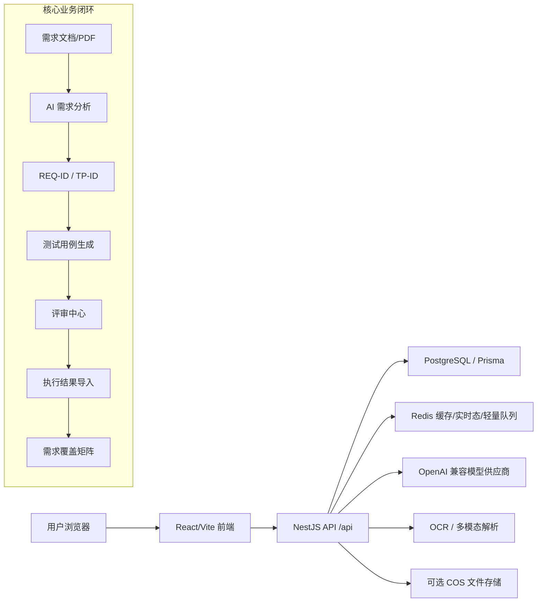

# AI 测试用例生成平台

[](backend/package.json)
[](frontend/package.json)
[](backend/prisma/schema.prod.prisma)
[](frontend/playwright.config.ts)

面向个人提效场景的 AI 测试工程平台。项目围绕“需求输入 -> AI 需求分析 -> 用例生成 -> 评审修订 -> 覆盖追踪 -> 执行结果回写”构建，重点解决流程图 PDF、需求文档、长输出模型、用例质量不稳定和交付闭环的问题。

当前代码以 `develop` 作为测试环境分支，`main` 作为生产环境分支。测试环境地址为 `http://139.199.69.115:8083`，生产环境地址为 `http://139.199.69.115`。

## 项目目标

- 提高需求文档和流程图 PDF 的解析质量。
- 生成结构化、可评审、可追踪的测试用例。
- 将需求 `REQ-ID`、测试路径 `TP-ID`、用例和执行结果串成覆盖矩阵。
- 支持 AI 长输出、自动续写、自动质量修复和多模型交叉评审。
- 通过 Redis 缓存、实时进度和轻量队列降低长任务对数据库的压力。

## 核心功能

| 模块 | 入口 | 现有能力 |
| --- | --- | --- |
| AI 需求分析 | `/ai-analysis` | 文档上传、PDF/图片/OCR/多模态解析、SSE 流式分析、结构化报告、评分卡、待确认问题、低质量输入提醒、报告版本和 diff |
| 流程图 PDF 解析 | 后端 `files` 模块 | 流程节点、分支、主路径、异常路径抽取；Mermaid 与 `TP-ID` 联动 |
| 用例生成 | `/generate` | 流式/非流式生成、JSON schema 约束、长输出自动续写、质量检查、自动修复、分页展示 |
| 评审中心 | `/reviews/:recordId` | 用例评审、结构化编辑、版本历史、评论、执行结果导入、需求覆盖矩阵 |
| 生成记录 | `/records` | 记录列表、详情、工作流状态、分享、导出、批量操作 |
| 模板管理 | `/templates` | 提示词模板 CRUD、模板评测任务、Redis 列表缓存 |
| 模型配置 | `/settings` | 多供应商模型配置、默认模型、视觉解析模型、连通性测试、删除模型配置 |
| 多模态与用量 | `/usage-stats` | 多模态运行配置、缓存、调用记录、成本估算 |
| 团队与权限 | `/teams`、认证模块 | 用户、团队、角色、JWT、限流、管理员审计 |

## 技术栈

| 层级 | 技术 |
| --- | --- |
| 前端 | React 18、TypeScript、Vite、Tailwind CSS、Zustand、React Router、Radix UI、Mermaid、Playwright |
| 后端 | NestJS 11、TypeScript、Prisma、PostgreSQL、JWT、Swagger、Helmet、Throttler |
| AI 与解析 | OpenAI 兼容接口、腾讯混元多模态、pdf-parse、pdf-to-img、tesseract.js、mammoth、xlsx、canvas、sharp |
| 缓存与任务 | Redis、ioredis、OCR Redis 缓存、文件解析实时进度、AI 流式输出快照、轻量 Redis 队列 |
| 部署 | Docker Compose、CNB 镜像、VPS 双环境、Nginx 反代 |
| 测试 | Jest、Vitest、Playwright E2E、Playwright CT、Allure |

## 架构概览



## 数据职责

- PostgreSQL 保存用户、团队、上传文件、解析结果、生成记录、测试用例、评审版本、覆盖矩阵、模型配置、用量和审计日志。
- Redis 保存短期、高频、可重建的数据：模板列表缓存、OCR 结果缓存、文件解析实时进度、AI 流式输出分片、轻量任务队列。
- 文件源可走本地 `uploads` 或 COS；轻量云策略会保留解析文本并清理过大的中间文件。

## 快速开始

### 1. 安装依赖

```bash
cd /Users/lewis/lewis_testcase_platform
pnpm -C backend install
pnpm -C frontend install
```

### 2. 准备环境变量

```bash
cp backend/.env.example backend/.env
cp docker-compose.full.env.example .env.development
```

至少需要配置：

- `DATABASE_URL`
- `JWT_SECRET`
- 一个可用 AI 模型配置，或在页面 `/settings` 里创建模型配置
- 如需 PDF/图片多模态解析，配置 `HUNYUAN_*` 或相应视觉模型配置

### 3. 启动依赖服务

```bash
docker compose -f docker-compose.full.yml --env-file .env.development up -d postgres redis
pnpm -C backend exec prisma generate --schema=./prisma/schema.prod.prisma
pnpm -C backend exec prisma migrate deploy --schema=./prisma/schema.prod.prisma
```

### 4. 启动开发服务

```bash
pnpm -C backend start:dev
pnpm -C frontend dev
```

浏览器访问 `http://localhost:5173`。后端 Swagger 在开发环境可访问 `http://localhost:3000/api/docs`。

## 常用验证命令

```bash
pnpm -C backend exec prisma generate --schema=./prisma/schema.prod.prisma
pnpm -C backend test
pnpm -C backend build
pnpm -C frontend test:unit
pnpm -C frontend build
pnpm -C frontend test:e2e -- tests/e2e/ai-analysis.spec.ts tests/e2e/reviews-center.spec.ts
```

最近一次 Redis 改造后的门禁结果见本地执行记录：后端 105 个测试通过，前端 46 个单测通过，核心 Playwright E2E 12 个通过、2 个 live 用例按配置跳过。

## 目录结构

```text
.
├── backend/                         # NestJS API、Prisma schema、Jest 测试
│   ├── prisma/schema.prod.prisma     # 生产 PostgreSQL schema，以此为准
│   ├── src/modules/ai/               # 需求分析、用例生成、质量修复、覆盖矩阵
│   ├── src/modules/files/            # 上传、PDF/OCR/多模态解析、解析进度
│   ├── src/modules/reviews/          # 评审中心、版本、评论、执行结果回写
│   ├── src/modules/ocr/              # OCR 缓存、队列、识别管线
│   └── src/redis/                    # Redis 缓存、队列、流式快照
├── frontend/                         # React 前端、Vitest、Playwright
│   ├── src/pages/                    # 主业务页面
│   ├── src/components/               # UI、分析、评审、模板、设置等组件
│   ├── src/api/                      # API client
│   └── tests/e2e/                    # Playwright E2E
├── docs/                             # 研发、部署、评估、QA、运维文档
├── scripts/                          # 部署、诊断、CI 辅助脚本
└── docker-compose*.yml               # 本地/开发/生产 compose
```

## 发布流程

测试环境：

```bash
cd /Users/lewis/lewis_testcase_platform
git switch develop
git pull --ff-only cnb develop
bash scripts/ops/deploy-develop.sh all
```

生产环境：

```bash
cd /Users/lewis/lewis_testcase_platform
git switch main
git pull --ff-only origin main
bash scripts/ops/deploy-main.sh all
```

详细流程见 [docs/operations/VPS_RELEASE_RUNBOOK.md](docs/operations/VPS_RELEASE_RUNBOOK.md)。

## 文档入口

| 文档 | 说明 |
| --- | --- |
| [docs/PROJECT_ASSESSMENT_AND_ITERATION_REPORT.md](docs/PROJECT_ASSESSMENT_AND_ITERATION_REPORT.md) | 项目完成度评估与迭代建议 |
| [docs/development/TEST_PLAN.md](docs/development/TEST_PLAN.md) | 当前测试策略与门禁清单 |
| [docs/development/ENVIRONMENT_VARIABLES.md](docs/development/ENVIRONMENT_VARIABLES.md) | 环境变量说明 |
| [docs/operations/VPS_RELEASE_RUNBOOK.md](docs/operations/VPS_RELEASE_RUNBOOK.md) | VPS 发布操作手册 |
| [docs/deployment/COMPOSE_FILES.md](docs/deployment/COMPOSE_FILES.md) | Compose 文件说明 |
| [CHANGELOG.md](CHANGELOG.md) | 变更日志 |

## 当前质量状态

| 维度 | 状态 |
| --- | --- |
| 架构 | 模块边界清晰，但 `AiService`、`FilesService`、部分页面文件过大，需要拆分编排层和领域服务 |
| 功能 | AI 需求分析、用例生成、评审、覆盖矩阵已形成闭环 |
| 性能 | Redis 已接入缓存、实时进度和流式快照；长任务仍需进一步引入可观测任务面板 |
| 安全 | JWT、角色守卫、限流、Helmet、敏感错误脱敏已存在；依赖审计和密钥轮换需常态化 |
| 测试 | 单元、组件、E2E 覆盖核心路径；真实外部模型/COS/数据库 live 用例仍需更明确的分层策略 |

## 未来规划

1. 将 `backend/src/modules/ai/ai.service.ts` 拆分为分析编排、生成编排、模型调用、流式恢复、覆盖矩阵五类服务。
2. 将 `backend/src/modules/files/files.service.ts` 拆分为上传、解析 worker、PDF 策略、进度同步、清理策略。
3. 为 Redis 队列增加任务状态页面，展示等待、执行、失败、重试和耗时。
4. 对接 Jira/TAPD/飞书，把需求 ID、用例 ID、执行结果回写到外部协作平台。
5. 补齐真实环境 live E2E：模型连通性、PDF 上传解析、评审中心回写、导出下载。
6. 建立定期依赖审计和安全基线文档，跟踪 Nest/Vite/Playwright 等工具链升级。

## 贡献约定

- 后端 schema 以 `backend/prisma/schema.prod.prisma` 为准。
- 修改业务逻辑必须补充或更新 Jest/Vitest/Playwright 测试。
- 不提交真实 `.env`、API Key、数据库口令、Cookie、上传文件和测试报告产物。
- 推送前至少运行与变更相关的测试；涉及核心链路时运行完整门禁。

## 许可证

当前仓库未声明开源许可证。对外公开或协作前，请先补充 `LICENSE` 并明确代码、文档和生成内容的使用范围。
