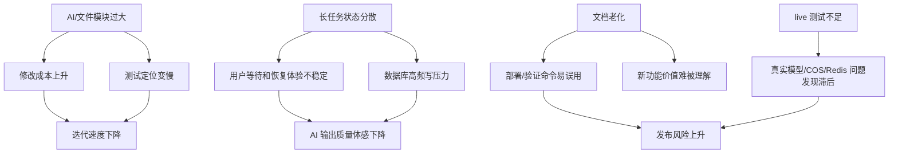

# 项目完成度评估与迭代建议报告

评估日期：2026-06-17
评估对象：`lewis_testcase_platform` 当前 `develop` 分支
评估范围：架构、代码质量、UI、功能、安全、交互、可扩展性、可维护性、场景覆盖率，以及 README/测试文档一致性。

## 摘要

项目已经从“AI 生成测试用例工具”演进为一个覆盖需求分析、流程图 PDF 解析、结构化用例生成、评审中心、覆盖矩阵和执行结果回写的个人提效平台。核心业务闭环已形成，测试和部署链路也具备基本工程化能力。

当前主要短板不是功能缺失，而是复杂度集中：`AiService`、`FilesService`、`AiAnalysisPage`、`GeneratePage` 等文件体量过大，长任务状态分散在数据库、Redis、SSE 和前端状态之间，后续继续扩展 Agent/Jira/飞书接入时需要拆分领域边界和任务编排层。

综合评级：**B+ / 可持续迭代阶段**。适合继续个人使用和小团队试用；若要变成稳定生产级平台，需要优先处理服务拆分、真实集成测试、可观测性、安全审计和文档治理。

## 证据来源

| 类型 | 证据 |
| --- | --- |
| 技术栈 | `frontend/package.json`、`backend/package.json` |
| 数据模型 | `backend/prisma/schema.prod.prisma`，含 30 个业务模型/配置/审计/任务实体 |
| 后端模块 | `backend/src/modules/*`，覆盖 AI、files、reviews、ocr、templates、settings、records 等 |
| 前端页面 | `frontend/src/pages/*`，覆盖 AI 分析、生成、记录、评审、模板、设置、用量 |
| 测试 | `backend/test/*.spec.ts`、`frontend/src/**/*.unit.test.ts`、`frontend/tests/e2e/*.spec.ts`、Playwright CT |
| 部署 | `.cnb.yml`、`docker-compose*.yml`、`docs/operations/VPS_RELEASE_RUNBOOK.md` |
| 安全与 QA | `docs/qa/SECURITY_QA_REPORT_2026-05-09.md`、`docs/development/QA_RELEASE_CHECKLIST.md` |

## 九维评估

| 维度 | 评级 | 亮点 | 风险/不足 | 改进建议 |
| --- | --- | --- | --- | --- |
| 架构 | B | 前后端分层清晰；Nest 模块覆盖核心业务；PostgreSQL 主存储 + Redis 实时态职责开始清晰 | `AiService` 2582 行、`FilesService` 2218 行，编排、领域逻辑、模型调用和持久化混在一起 | 拆分 AI 分析、用例生成、模型客户端、覆盖矩阵、流式恢复；文件模块拆分上传、解析 worker、PDF 策略、进度同步 |
| 代码质量 | B | 有大量领域 util 和单测，AI 输出 schema/质量修复/流程图解析已有独立测试 | 大页面和大 service 增加修改成本；部分测试里仍会触发 worker 异步日志噪声 | 将长函数拆成可注入服务；为 worker 提供测试模式关闭开关；建立复杂度阈值，如单文件超过 800 行必须拆分计划 |
| UI | B | 主业务页面完整，深色工作台、评审中心、评分卡、覆盖矩阵、版本 diff 已具备专业工具感 | `AiAnalysisPage` 3258 行、`GeneratePage` 2193 行，页面状态复杂；README 没有真实截图/动图资产 | 按“上传区/进度终端/报告区/版本区/策略区”拆组件；补充 `docs/assets/screenshots/` 并在 README 引用 |
| 功能完整性 | A- | 已实现需求分析、流程图路径、REQ/TP ID、用例生成、评审、执行结果回写、模型配置、模板、用量 | Jira/TAPD/飞书未接入；Agent 自动执行仍是准备清单和结果导入为主 | 先做外部系统抽象接口，再接 Jira/TAPD/飞书；Agent 执行以 Playwright JSON 结果导入作为第一阶段 |
| 安全性 | B | JWT、角色守卫、限流、Helmet、敏感信息示例隔离、COS 探针不回显密钥 | QA 报告显示依赖审计仍有 moderate/high；模型 API key 加密存储但需补充轮换流程 | 建立月度 `pnpm audit` 门禁；补 `docs/security/SECURITY_BASELINE.md`；为模型 key 增加最近使用和禁用策略 |
| 交互体验 | B+ | SSE 流式输出、解析进度、长输出提示、自动续写、质量修复提示改善了等待体验 | 长任务失败恢复入口不够显式；Redis 流式快照 API 已有，但页面自动恢复还未完成 | 在 AI 分析/生成页增加“恢复上次流式输出”入口；任务终端显示 Redis 队列状态和失败原因 |
| 可扩展性 | B | Prisma schema 已支持版本、覆盖矩阵、批量任务、多模型配置；Redis 已承担缓存/进度/轻量队列 | 轻量 Redis 队列还不是完整 BullMQ 级语义，缺少重试、死信、任务状态 UI | 阶段性保留 ioredis 队列；并发上升后迁移 BullMQ，保留当前 `RedisService` 作为适配层 |
| 可维护性 | B- | 文档数量多，发布 Runbook 详细，测试覆盖关键 util | 文档老化明显：`README.md` 最近更新停在 2026-05，`TEST_PLAN.md` 仍聚焦认证流程 | 用 README 作为入口，评估报告作为路线图，测试计划作为门禁；每次核心功能提交同步文档 |
| 场景覆盖率 | B | 有 AI 分析、评审中心、生成主流程 E2E；后端 105 个测试覆盖多项业务规则 | live E2E 默认跳过；真实模型、真实 PDF、COS、多模型交叉评审和 Redis 恢复缺少稳定验收 | 建立三层测试：mock E2E、VPS smoke、live nightly；为 PDF 2-3 页流程图样例建立固定夹具 |

## 跨维度问题关联图

## 高优先级迭代方案

### P0：拆分 AI 与文件解析主服务

问题：`AiService` 和 `FilesService` 是核心复杂度集中点。继续在大文件内叠加 Agent、Jira、飞书会显著增加回归风险。

建议路径：

1. 新建 `AiAnalysisOrchestratorService`：只负责需求分析流式编排、版本、结构化结果。
2. 新建 `TestCaseGenerationOrchestratorService`：只负责用例生成、schema 修复、质量报告。
3. 新建 `AiStreamRecoveryService`：封装 Redis stream snapshot、streamId、恢复 API。
4. 新建 `FileParseWorkerService`：封装 PENDING/PARSING 认领、僵尸任务恢复、实时进度。
5. 为每次拆分加“行为不变”测试，避免重构时改变接口。

验收：

- `pnpm -C backend test` 通过。
- `AiService` 降到 800 行以下，`FilesService` 降到 900 行以下。
- 现有 `/ai/generate/stream`、`/ai/analyze/stream`、`/files/:id/events` 响应兼容。

### P1：完善长任务和 Redis 队列可观测性

问题：Redis 已承担 OCR 缓存、解析实时态、轻量队列和流式快照，但前端还没有统一任务面板。

建议路径：

1. 后端增加 `/api/runtime/queues`，返回 `file-parse`、`ai-analysis`、`ai-generate`、`ai-cross-review` 长度和最近错误。
2. 文件解析、AI 分析、生成页展示任务 ID、队列状态、最近心跳。
3. 对 Redis 不可用增加明确 degraded 日志和前端提示。

验收：

- Redis 正常时能看到队列长度变化。
- Redis 关闭时，业务流程退回 DB/SSE 方案且页面有降级提示。

### P1：补齐真实业务验收夹具

问题：核心 E2E 多为 mock，真实 PDF/模型/COS 仍依赖手工验证。

建议路径：

1. 固定一份 2-3 页流程图 PDF 测试夹具，脱敏后放入 `backend/test/fixtures/files/`。
2. 增加 smoke 脚本：上传文件 -> 等解析 -> 调 AI 分析 -> 检查评分卡和 REQ/TP。
3. live 用例使用环境变量显式开启，默认不跑真实模型。

验收：

- `LIVE_AI_SMOKE=1` 时可在 VPS dev 跑完整链路。
- 失败报告包含 recordId、fileId、模型配置 ID 和最近 100 行后端日志。

### P2：文档治理与截图资产

问题：文档数量多但入口分散，README 之前没有同步最新 Redis、覆盖矩阵、评审中心能力。

建议路径：

1. 将 README 作为唯一入口。
2. `docs/README.md` 只做索引，不承载过时流程。
3. 在 `docs/assets/screenshots/` 补充 AI 分析、生成页、评审中心、设置页截图。
4. 每个 P1 以上功能提交必须同步 README 或对应专题文档。

验收：

- 新成员按 README 可完成本地启动。
- 运维人员按 Runbook 可完成 develop/main 发布。

## 可执行 Backlog

| 优先级 | 任务 | 涉及文件/模块 | 验收标准 |
| --- | --- | --- | --- |
| P0 | 拆分 AI 分析编排服务 | `backend/src/modules/ai/ai.service.ts` | 分析相关逻辑迁出，接口兼容，后端测试通过 |
| P0 | 拆分文件解析 worker | `backend/src/modules/files/files.service.ts` | worker 认领/恢复/心跳独立，解析 E2E 不回归 |
| P1 | 长任务状态面板 | `backend/src/redis`、`frontend/src/pages/AiAnalysisPage.tsx` | 页面可看到队列、心跳、恢复入口 |
| P1 | Redis 降级测试 | `backend/test/redis-runtime.spec.ts` | Redis 不可用时缓存/队列 API 不抛出业务错误 |
| P1 | 真实 PDF smoke | `backend/scripts`、`frontend/tests/e2e` | dev 环境可上传固定 PDF 并验证 REQ/TP 输出 |
| P2 | 安全基线文档 | `docs/security/SECURITY_BASELINE.md` | 覆盖密钥、CORS、依赖审计、日志脱敏、备份 |
| P2 | 截图资产 | `docs/assets/screenshots/` | README 展示当前核心页面 |
| P3 | Jira/TAPD/飞书适配层 | `backend/src/modules/integrations` | 先支持需求覆盖矩阵导出/回写，不绑定单一平台 |

## 文档重构结论

本次已重构：

- 根目录 `README.md`
- `docs/development/TEST_PLAN.md`
- `docs/README.md` 文档索引

建议后续继续重构：

- `docs/development/ROADMAP.md`：目前内容偏旧，应拆成“已完成/下一阶段/待规划”。
- `docs/qa/SECURITY_QA_REPORT_2026-05-09.md`：日期较旧，应追加 2026-06 的依赖审计和 Redis 改造后的安全影响。
- `docs/development/ENVIRONMENT_VARIABLES.md`：补充 Redis、AI 长输出、PDF 快速解析和队列相关变量的分组说明。

## 综合评级

| 维度 | 分数 |
| --- | --- |
| 架构 | 78 |
| 代码质量 | 76 |
| UI/UX | 80 |
| 功能完整性 | 86 |
| 安全性 | 75 |
| 交互体验 | 82 |
| 可扩展性 | 78 |
| 可维护性 | 72 |
| 场景覆盖率 | 77 |

最终综合评级：**B+（79/100）**

一句话总结：项目已经具备完整 AI 测试工程闭环，下一阶段应从“继续加功能”转向“拆复杂度、补真实验收、做任务可观测”，这样才能承接 Agent 自动执行和外部协作平台集成。
